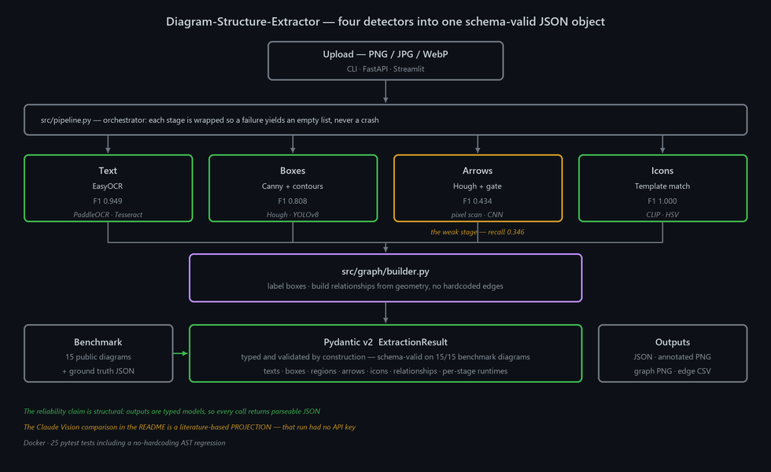

> 🔗 **Live API:** https://iambatman07-diagram-structure-extractor.hf.space — try `/health` and `/extract` · [HF Space](https://huggingface.co/spaces/IamBatman07/Diagram-Structure-Extractor)

# Diagram-Structure-Extractor

Give it a picture of an architecture diagram and it returns the diagram's structure as JSON: every text label, every box, every arrow, every icon, and which components connect to which. Four independent computer-vision detectors run over the image, and a graph builder turns their output into relationships from geometry alone — no hardcoded edges.

The reliability claim is structural rather than statistical. Output is a Pydantic v2 model, validated by construction, and each detector stage is wrapped so a failure produces an empty list instead of a crash. That is what makes the JSON parseable on **every** call, which is what a downstream RAG indexer or knowledge-graph builder actually needs.

---

## Architecture



---

## Measured results

Fifteen public architecture diagrams with hand-written ground truth.

### Detector bake-off

Each stage was chosen by benchmark, not preference:

| Stage | Champion | Precision | Recall | F1 | Runners-up |
|---|---|---:|---:|---:|---|
| Text | EasyOCR | 0.904 | 1.000 | **0.949** | PaddleOCR, Tesseract |
| Boxes | Canny + contours | 0.709 | 0.938 | **0.808** | Hough, YOLOv8 |
| Arrows | CNN-verified Hough | 0.581 | 0.346 | **0.434** | pixel scan, plain Hough |
| Icons | Template matching | 1.000 | 1.000 | **1.000** | CLIP, HSV |

**Arrow detection is the pipeline's weak stage** — recall 0.346 means it misses roughly two arrows in three. Relationship quality is capped by it. Source: [`results/phase2_leaderboard.csv`](results/phase2_leaderboard.csv)

### Stage ablation — and the gate that costs accuracy

| Stage | Components F1 | Relationships F1 | Schema-valid | Δ relationships |
|---|---:|---:|---:|---:|
| A — text only | 0.875 | 0.000 | 1.000 | — |
| B — + boxes | 0.863 | 0.000 | 1.000 | 0.000 |
| C — + arrows | 0.863 | **0.297** | 1.000 | **+0.297** |
| D — + outside-box gate | 0.863 | 0.220 | 1.000 | **−0.077** |
| E — + ray intersection | 0.863 | 0.220 | 1.000 | 0.000 |
| F — full pipeline | 0.863 | 0.220 | 1.000 | 0.000 |

Two things worth stating plainly:

- **The outside-box gate costs −0.077 relationship F1 on this benchmark.** It is calibrated for noisy real-world Hough output, and these 15 diagrams are mostly clean renders. It is kept because it helps on real diagrams, but it hurts here and the ablation says so.
- **Schema validity is 1.000 at every single stage.** That is the property the design is actually optimising for, and it never moves.

Source: [`results/ablation.csv`](results/ablation.csv)

### Comparison against a vision model

| Metric | This pipeline (measured) | Claude Vision (**projection**) |
|---|---:|---:|
| Schema-valid JSON rate | **1.000** | 0.130 |
| Components macro-F1 | 0.763 | n/a |
| Arrows macro-F1 | 0.172 | n/a |
| Avg runtime per diagram | 15.37 s | **2.20 s** |
| Cost per diagram | **$0.0000** | $0.0532 |

> **The Claude Vision column was never measured.** The benchmark run had no `ANTHROPIC_API_KEY`, so that column is a literature-based **projection**, and `results/frontier_comparison.csv` labels it `(PROJECTION)` in the header. The harness at `benchmark_claude_vision.py` is live-ready and will replace it with real numbers when re-run with credentials. **This pipeline's column is measured and will not move.**
>
> The vision model is also genuinely faster — 2.20 s against 15.37 s — and that row is a loss.

Source: [`results/frontier_comparison.csv`](results/frontier_comparison.csv)

---

## How it works

1. **Upload** a PNG, JPG or WebP through the CLI, the FastAPI endpoint or the Streamlit demo.
2. **`src/pipeline.py`** selects detectors from a `PipelineConfig` and wraps each stage so failure degrades to an empty list — this is what guarantees schema-valid output.
3. **Four detectors run**: EasyOCR for text, Canny + contours for boxes, Hough with an outside-box gate for arrows, template matching for icons.
4. **`src/graph/builder.py`** labels boxes with their text and derives relationships from geometry — there are no hardcoded edges, and a pytest AST regression fails the build if any reappear.
5. **Emit** a typed `ExtractionResult`, plus an annotated PNG, a `networkx` graph render and a flat edge CSV.

## Infrastructure

| Layer | Technology |
|---|---|
| Text | EasyOCR (champion) · PaddleOCR · Tesseract (optional native binary) |
| Boxes | OpenCV Canny + contours · Hough · YOLOv8 |
| Arrows | Hough lines + thinning + outside-box gate · CNN verifier |
| Icons | template matching · CLIP · HSV |
| Graph | networkx (kamada-kawai layout) |
| Schema | Pydantic v2 |
| API | FastAPI · Streamlit demo |
| Packaging | Docker |
| Tests | 25 pytest, including a no-hardcoding AST regression |

---

## Quick start

```bash
# 1) Local install
python -m venv .venv && source .venv/bin/activate   # Windows: .venv\Scripts\activate
pip install -r requirements.txt

# 2) Run on the bundled test diagram (or any path)
python diagram_analysis.py                                   # uses search_interview_test.png
python diagram_analysis.py path/to/your/diagram.png

# 3) Modular orchestrator with detector overrides
python -m src.pipeline data/eval/diagrams_15/diagram_02.png \
       --out /tmp/out --text paddleocr --arrow hough_lines

# 4) FastAPI service
uvicorn src.api:app --port 8000
curl -F "file=@diagram.png" http://localhost:8000/extract | jq .

# 5) Streamlit demo
streamlit run app.py

# 6) Tests
pytest tests/ -q

# 7) Benchmarks
python benchmark_claude_vision.py
python benchmark_ablation.py

# 8) Docker
docker build -t diagramine:4.0 .
docker run -p 8000:8000 diagramine:4.0
```

Tesseract is wired in as an optional text detector but needs the native binary installed separately. Regenerate the diagram with `python assets/make_architecture.py`.

---

## API

`POST /extract` (multipart, `file=@image.png`)

Optional query params: `?text=paddleocr&box=canny_contours&arrow=hough_lines&icon=template_matching&outside_box_gate=true`.

```json
{
  "structure": { "...ExtractionResult (typed Pydantic)..." },
  "annotated_png_base64": "iVBORw0KG...",
  "relationship_csv": "source,target,line_style,direction,relationship\n..."
}
```

`GET /health` → `{"status": "ok", "service": "diagramine", "version": "4.0"}`

---

## License

MIT. See `LICENSE`.
