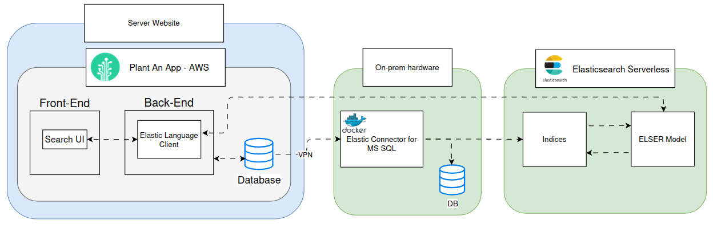
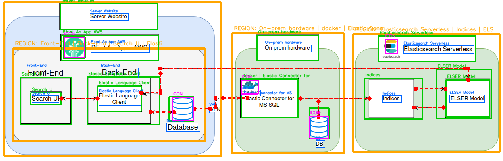
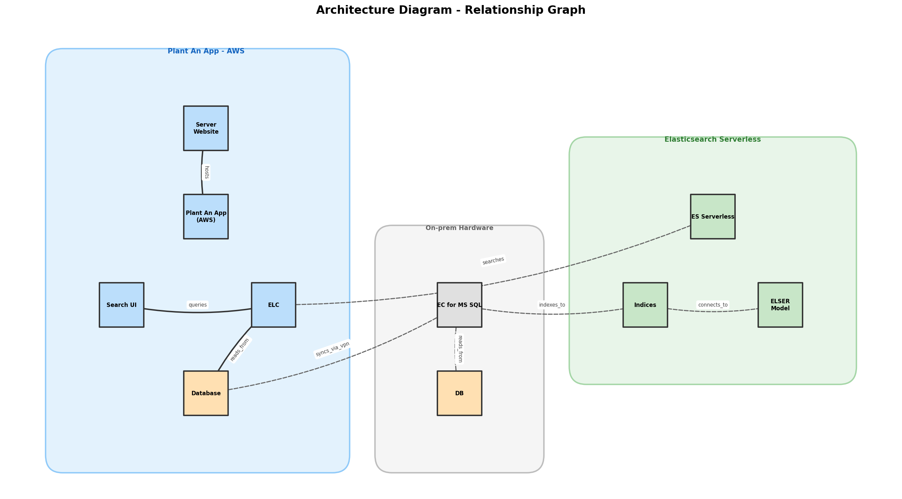

# DiagraMine

**Extract architecture and design diagram structure automatically** — text labels, component boxes, connections, and icons.

DiagraMine analyzes a diagram image and pulls out all the information: what components exist, what they're labeled, and how they connect to each other. It outputs annotated images, relationship graphs, and structured data (JSON + CSV).

## Features

- **Text Detection** — OCR-based extraction of all labels and text
- **Component Detection** — Finds boxes and regions in the diagram
- **Arrow/Connection Detection** — Identifies dashed arrows and relationships between components
- **Icon Detection** — Locates logos and visual markers (Docker, databases, etc.)
- **Relationship Mapping** — Builds a directed graph of component connections
- **Multiple Output Formats** — Annotated image, graph visualization, JSON, and CSV

## What You Get

| Output | Format | What's In It |
|--------|--------|-------------|
| `annotated_diagram.png` | Image | Original diagram with all detected elements highlighted |
| `relationship_graph.png` | Image | Directed graph showing how components connect |
| `extracted_structure.json` | JSON | Complete structured data (text, boxes, arrows, icons, relationships) |
| `extracted_data.csv` | CSV | Flat table of components and their connections |

## How It Works

### 1. Text Detection
Uses **EasyOCR** (CRAFT + CRNN neural networks) to read text from the image. Nearby text fragments are merged together to fix split detections.

### 2. Box Detection
OpenCV **Canny edge detection** + contour tracing finds rectangles. Large shapes (>25,000 px) are background regions. Smaller ones are components.

### 3. Arrow Detection
Scans every pixel row looking for the pattern of a dashed line: short dark segments (3-15 px) with regular gaps (5-16 px). Filters out false positives on box borders and text. Supplements with auto-generated connections from box spatial logic.

### 4. Icon Detection
**HSV color segmentation** picks out colorful icons in a mostly gray/white diagram (Plant An App, Docker whale, database cylinders, Elasticsearch logo, etc.).

### 5. Relationship Mapping
Arrows are mapped to the nearest boxes to determine what connects to what. Builds a directed graph and visualizes it.

## Installation

### Requirements
- Python 3.8+
- OpenCV with contrib modules
- EasyOCR
- NetworkX
- NumPy
- Matplotlib

### Setup

```bash
pip install opencv-python opencv-contrib-python easyocr networkx matplotlib numpy
```

## Usage

```python
python diagram_analysis.py
```

The script processes `search_interview_test.png` in the same directory and outputs:
- `annotated_diagram.png`
- `relationship_graph.png`
- `extracted_structure.json`
- `extracted_data.csv`

## Example Input & Output

### Input Diagram


### Annotated Output
The script detects and highlights all components:


### Relationship Graph


### Detection Results
- 15 text labels
- 15 component boxes
- 4 background regions
- 14 dashed arrows (10 detected + 4 auto-generated)
- 5 icons
- 10 relationships

## Why These Tools?

- **EasyOCR** — Zero setup, high accuracy, no API keys needed
- **OpenCV** — Industry standard, fast (C++ backend), comprehensive CV toolkit
- **NetworkX** — Simple directed graph structure and visualization
- **NumPy** — Foundation for both OpenCV and EasyOCR

## Limitations & Future Improvements

Current approach works well for this specific diagram but thresholds are tuned for it. Very different-looking diagrams may need adjustments.

**With more time:**
- Use Vision-Language Models (GPT-4o, Claude) for higher accuracy
- Train YOLOv8 on labeled diagram datasets for end-to-end detection
- Apply Graph Neural Networks to predict connections from box positions alone
- Support multiple diagram styles and layouts

## Project Structure

```
DiagraMine/
├── diagram_analysis.py          # Main analysis script
├── search_interview_test.png    # Input diagram (referenced in code)
├── annotated_diagram.png        # Output: labeled diagram
├── relationship_graph.png       # Output: connection graph
├── extracted_structure.json     # Output: structured data
├── extracted_data.csv           # Output: flat data table
├── overview.md                  # Project overview
├── report.md                    # Detailed analysis report
├── README.md                    # This file
└── LICENSE                      # MIT License
```

## License

This project is licensed under the MIT License — see [LICENSE](LICENSE) for details.

## Author

Created by Mark, Data Scientist  
DiagraMine © 2026
